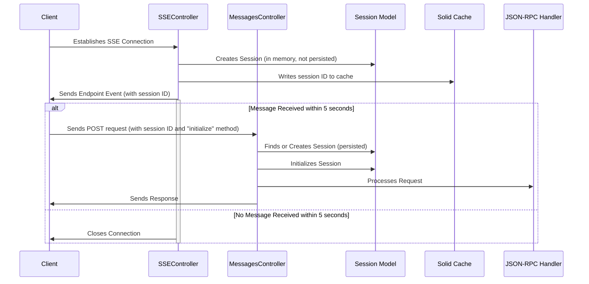

## Session Creation Flow Diagram

## Explanation

1.  The client initiates an SSE connection to the `SSEController`.
2.  The `SSEController` creates a `Session` object in memory but does not persist it to the database.
3.  The `SSEController` writes the session ID to the cache.
4.  The `SSEController` sends an endpoint event to the client, including the session ID.
5.  The `SSEController` waits for 5 seconds for a message from the client.
6.  If the `MessagesController` receives a POST request with the "initialize" method within 5 seconds:
    *   The `MessagesController` finds or creates the session in the database using the session ID.
    *   The `MessagesController` initializes the session.
    *   The `MessagesController` processes the request using the JSON-RPC handler.
    *   The `MessagesController` sends a response to the client.
7.  If no message is received within 5 seconds, the `SSEController` closes the connection.